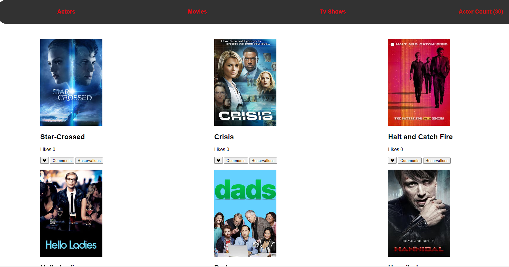

# Group Capstone 

In this project we worked collaboratively as a Group to implement a web app wich shows informations about movie shows. 

The app fetches data from the Tvmaze Api,  and users can interactively add likes to their favourite shows. 

The greatest features is making reservations and making comments and more so that we can read other people comments about the movie show. 

If you like what you see and have a project you need coded, don't hesitate to contact us.


# Screenshot
 

##Live Deploy


[video presentation](https://drive.google.com/file/d/19XV32Kyiy6z-5QU6gO0r5RLOhZt1G9ZI/view?usp=sharing)


# Built With

- Major languages: HTML,CSS and Javascript
- Technologies used: Web services, webpack, API


# Getting Started

To get a local copy up and running follow these simple example steps:

## Prerequisites 
- A working Laptop or Desktop
## Setup
- Install code editor
- Install Git bash
- Install webpack
## Install
- clone the [project](https://github.com/mutinhiri/Group-Capstone-).
## Usage
- Test your GitHub flow, a linter and professional documentation ability
## Run tests
- Run npm run build to rebuild the project
- Run npm run start to run the project
## Deployment
- Push the project to your GitHub repo
- Navigate to page in the project settings and publish.


### Run tests
npm  test  ( to run the test created in order to test the funcions with jest) 

Javascript linters

```
    npx eslint .
```

HTML linters

```
    npx hint .

```

CSS linters

```
    npx stylelint "**/*.{css,scss}"
```


# Authors

👤 **Bunbee**
  - GitHub: [Bunbee](https://github.com/mutinhiri).
  - Twitter: [@Bunbee02](https://twitter.com/Bunbee02).
  - LinkedIn: [@bunbee](https://www.linkedin.com/in/bunbee).


👤 **Amel Khiri**
- GitHub: [@Algerina](https://github.com/Algerina)
- LinkedIn: [Amel Khiri](https://linkedin.com/in/amel-khiri-qahwadji-37a550135)

👤 **Anibal Amoroso**
- GitHub: [@js1978](https://github.com/sj1978)
- LinkedIn: [Anibal Amoroso](https://www.linkedin.com/in/anibal-amoroso-a5330921b/)


# Contributing

Contributions, issues, and feature requests are welcome!

Feel free to check the [issues page](https://github.com/mutinhiri/Group-Capstone-/issues).

# Show your support

Give a :star: if you like this project!


## Acknowledgments

- Hat tip to anyone whose code was used
- Inspiration
- etc
